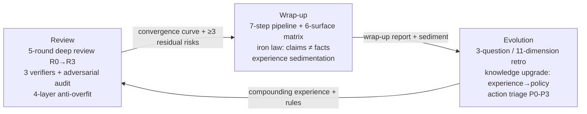

# Turning Agent Sessions into a Pipeline: Review → Wrap-up → Evolution (3 Open-Source Skills)

> Most people work with AI the "use-and-throw" way: tasks finish, conclusions go unverified, experience
> goes unrecorded, and the next session starts from zero. This post shows how I turned sessions into a
> compounding pipeline with three Agent Skills — all open source (Apache-2.0), with multi-way install guides.

---

## 1. Three real pain points

Three problems you've probably hit.

**Pain point 1: False convergence.**
You ask an agent to fix a batch of bugs or write a long doc. It reports "0 issues, done." You ask it to check again more carefully — five or six issues surface immediately. It's not lying; it ran a **single** shallow pass and concluded. Worse, it vouches for things that only "look complete."

**Pain point 2: Wrap-up lives in memory.**
When a session ends, what files changed, what was verified, what's pending — all of it lives in the agent's context window. New session, gone. Docs say "synced" but the files were never touched; code says "fixed" but git has no commit.

**Pain point 3: Experience doesn't compound.**
The pitfalls, the methods, the one-off scripts — discarded after use. The next session re-steps the same traps. Agents don't "learn" on their own unless you turn memory into protocol.

The common root: **agent sessions have no lifecycle management**. I treated this as an engineering problem — hence three skills forming a closed loop.

## 2. The solution: a three-skill closed loop



> Vector version: [docs/images/session-loop-pipeline.svg](https://github.com/1273984347/agent-session-loop/blob/main/docs/images/session-loop-pipeline.svg)

The three skills stand alone, and combine into one pipeline:

| Skill | Role | Core mechanism |
|---|---|---|
| [deep-review-loop](https://github.com/1273984347/deep-review-loop) | Review | 5 rounds (R0-R3) + 4-layer anti-overfit |
| [mem-wrap-up](https://github.com/1273984347/mem-wrap-up) | Wrap-up | 7-step pipeline + 6-surface matrix + verification iron law |
| [self-evolution](https://github.com/1273984347/self-evolution) | Evolution | 3-question / 11-dimension retro + knowledge upgrade |

Want all-in-one? Install [agent-session-loop](https://github.com/1273984347/agent-session-loop) — the three phases wired into one lifecycle pipeline.

## 3. deep-review-loop: make review a real loop

One iron law at its core: **no false convergence**.

A normal review is "review → fix → verify" and done. This skill turns it into:

```text
review → fix → re-review → fix → re-review → … until N consecutive rounds find nothing new
```

Concretely, a 5-round protocol:

- **R0** — Surface check. File size, verdict-word grep ("done / PASS / OK"), project-stage judgment.
- **R1a** — Three independent verifier subagents, three lenses: **factual accuracy** (numbers/paths/references), **completeness** (claimed scope vs actual), **reusability** (can a stranger follow it cold-start).
- **R1b** — One adversarial subagent, **default refuted=true**: attack, don't validate.
- **R2** — Independent audit. Explicitly forbidden to self-audit (Self-audit ≠ independent audit).
- **R3** — Must write ≥3 residual risks + a convergence curve, even at 0 findings.

**Anti-overfitting** is the other half. Review can spiral ("fix more, find more"), so there are 4 layers:

1. **P2 residual N** — P0/P1 must reach 0, but P2 (UX-level) may remain (competition 0 / production 3 / prototype 10);
2. **Marginal-benefit gate** — fix cost > harm × 3 → mark "accept residual";
3. **Overfit alarm** — issue count rising across rounds, or regression rate >30% → STOP and report instead of force-fixing;
4. **Severity threshold** — P3 and below are not reported, to avoid noise.

One detail worth copying: **every finding must attach tool-call evidence**. A verifier claiming "this directory doesn't exist" must attach an `LS` output; "this line is wrong" must attach a `Read` output; even "0 findings" requires evidence you actually looked. This closes the door on fabricated conclusions.

## 4. mem-wrap-up: make wrap-up a handoff-ready state

Ending a session isn't "goodbye"; it's auditing state until handoff-ready. A 7-step pipeline:

```text
1. memory health check        2. memory audit (5 phases) + 6-surface matrix
3. fileCount sync             4. doc-sync spot-check + work-log
5. experience sedimentation   6. 4-step verify
7. memory-layer re-check + reverse review
```

The **6-surface state matrix** is my favorite part: consistency is split into six factual surfaces — code, runtime, docs, rules, memory, workspace. Each surface must be labeled (`verified-current / pending / not-applicable`). Small project with no deployment? Runtime is `not-applicable`. **No fabricated evidence.**

The **verification iron law** is the soul:

> Grep spot-check file contents — verify the version number and task ID actually landed. **Never trust a prior session's "already done" claim.**

Why? "Edit succeeded" ≠ "file actually changed" — a mismatched `old_string` fails silently, parallel edits overwrite each other, and edits without verification are white noise. I got burned by this a dozen times in real projects, then hardened it into law: **claims ≠ facts; verification is what counts**.

## 5. self-evolution: make retro compounding

The final step turns session experience into reusable rules. Two modes:

**Quick mode** (auto after every task): a 3-question self-check — any new discovery? any pitfall? any skill gap? If yes, write to experience-log; if no, skip. Cheap enough to run every time.

**Full mode** (weekly summary / retro): 11 dimensions — experience reuse, skill evaluation, problem prevention (forced 5Why), workflow optimization, one-off tool sedimentation… two dimensions are **mandatory**:

- **Dimension 9: one-off tool sedimentation.** Scripts/commands written during the task — discard or turn into a template? Runs even on the 1st occurrence, no need to wait for 3.
- **Dimension 11: retro of the retro.** Did the retro itself hit pitfalls? Meta-layer safety net.

Then the **knowledge upgrade chain**:

```text
experience → pattern (≥3 occurrences) → heuristic (success rate >80%) → policy (requires human confirmation)
```

Note the last step: `policy` **requires human confirmation**. AI shouldn't legislate its own rules. And the single-source-of-truth principle — experience-log is the authority, quickref is the index, retrospective is the report. **Never duplicate into a second source of truth.**

## 6. All-in-one: agent-session-loop

Managing three skills is too much? [agent-session-loop](https://github.com/1273984347/agent-session-loop) wires the three phases into one pipeline. Each phase's output is the next phase's input: review's residual risks become wrap-up's verification checklist; wrap-up's sediment becomes retro's analysis material; retro's rule upgrades feed the next session. **The last session's conclusions become the next session's starting point — that's compounding.**

It also supports scenario-based trimming: debug-only sessions run wrap-up only; batch-fix sessions emphasize review; weekly summaries emphasize evolution. Trimming must be explicitly marked `not-applicable` — **no silent skips**.

## 7. Installation: three ways

All three skills are standard Agent Skills (`SKILL.md` + `references/`), installable by any Agent Skills client.

**Option A: copy the folder (universal)**

```bash
git clone https://github.com/1273984347/deep-review-loop.git
cp -r deep-review-loop <your-skills-dir>/deep-review-loop
# same for mem-wrap-up / self-evolution / agent-session-loop
```

**Option B: Claude Code plugin marketplace (one command)**

Inside Claude Code:

```text
/plugin marketplace add 1273984347/deep-review-loop
/plugin install deep-review-loop@deep-review-loop
```

All four repos ship `.claude-plugin/marketplace.json` — works out of the box.

**Option C: skills.sh CLI (the npm of agents)**

```bash
# install Anthropic's official skills CLI
npm install -g @anthropic-ai/skills
# install the skill from this repo
npx skills add https://github.com/1273984347/deep-review-loop
```

## 8. Engineering details: standard, CI, MCP

Open-sourcing isn't just pushing markdown to GitHub. I did three things per the open Agent Skills standard ([agentskills.io](https://agentskills.io)):

**1. Standard format.** Frontmatter: `name` must equal the directory name (lowercase + hyphens, ≤64 chars); `description` is bilingual and imperative ("Use when…") to help agents trigger; `license: Apache-2.0`. The body follows **progressive disclosure**: SKILL.md stays <500 lines, details move to `references/`, loaded on demand.

**2. CI validation.** Every repo has GitHub Actions running the official `skills-ref validate`:

```yaml
- name: Validate SKILL.md
  run: skills-ref validate "$PWD"
```

**3. MCP extension point.** Skills and MCP are complementary: MCP provides external tool/data connections; Skills teach agents how to orchestrate complex workflows over those tools. So MCP is an **optional dependency** — use the server if present, fall back to built-in tools otherwise. Never hard-bind.

## 9. Pitfalls you only learn from open-sourcing

The process itself validated the review skill:

1. **UTF-8 BOM trap** — a BOM (EF BB BF) at the file head makes `skills-ref` fail on "SKILL.md must start with `---`". File-writers may add BOMs; GitHub won't complain, validators will.
2. **Path parameterization** — the originals were full of absolute paths (`C:\Users\...`). The open versions use `<memory_root>` / `<project-slug>` placeholders. **Sanitize your own skills first.**
3. **Description is the trigger lifeline** — agents decide to load a skill from name + description alone. Too vague → never triggered; too broad → triggered where it shouldn't be.

## 10. Closing

The biggest change for me: **AI collaboration went from "conversation" to "compounding."** Every session ends with verified conclusions, handoff-ready state, and sedimented experience — the starting point of the next session.

Repos (Apache-2.0, stars / PRs / issues welcome):

- [agent-session-loop](https://github.com/1273984347/agent-session-loop) — all-in-one pipeline
- [deep-review-loop](https://github.com/1273984347/deep-review-loop) — review
- [mem-wrap-up](https://github.com/1273984347/mem-wrap-up) — wrap-up
- [self-evolution](https://github.com/1273984347/self-evolution) — evolution

If you work with agents long-term, try building your own review → wrap-up → evolution loop. It doesn't have to be mine — but you need one.

---

*Suggested tags: Agent Skills · AI Agents · Claude Code · Developer Tools · Open Source*
